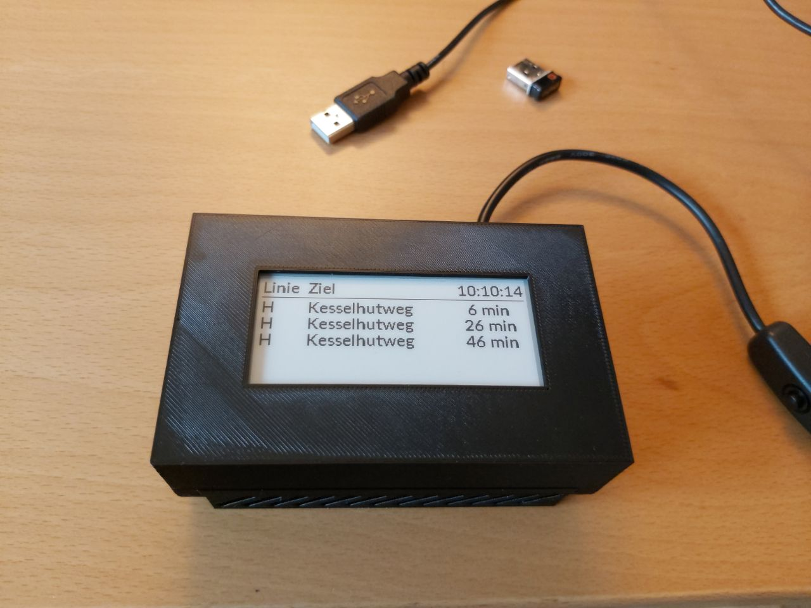

# RMV Timetable Viewer

This is a small piece of software allowing bus and tram departures for some station to be shown on a small e-ink display.

It is specific for the RMV, the *Rhein-Main-Verkehrsverbund*, a regional Hessian public transport provider.
It interfaces with their [open data portal](https://opendata.rmv.de/), but should work with most HAFAS APIs with only minor modifications.



## Hardware

It uses an (overkill) Raspeberry Pi 3, as the case was already designed for that.
The case can be 3D printed from the files given in `3d-print-template/`.
The display we used was the *2.9inch E-Ink Module 296x128*/*2.9inch e-Paper Module* by *Waveshare*. Links to: [Amazon](https://www.amazon.de/gp/product/B071JFRV2S/), [Waveshare Wiki](https://www.waveshare.com/wiki/2.9inch_e-Paper_Module). The required "drivers" are in `epd2in9/`.


## Installation

This assumes that you have an API token obtained from [RMV Open Data](https://opendata.rmv.de/site/anmeldeseite.html).

1. Download and install [*Raspbian Lite*](https://downloads.raspberrypi.org/raspbian_lite_latest). This was tested with version *Buster*, late 2019. Also configure it such that internet access is possible. See [headless setup](https://www.raspberrypi.org/documentation/configuration/wireless/headless.md).

2. (Optional.) Update the system initially and reboot.
```bash
sudo apt update
sudo apt full-upgrade
sudo reboot now
```

3. (Optional.) Enable automatic updates.
```bash
# install:
sudo apt install unattended-upgrades -y
# configure:
sudo dpkg-reconfigure -plow unattended-upgrades
```

4. Install some dependencies
```bash
sudo apt install git python3-pip python3-pil python3-spidev python3-rpi.gpio python3-dateutil fonts-lato -y
```

5. [Enable SPI](https://www.raspberrypi.org/documentation/hardware/raspberrypi/spi/README.md).

6. Adjust the timezone to (for example) Germany/Berlin. This can be done from within `sudo raspi-config`. Restart after this just to be sure. ;)

7. Clone the git repo onto the Pi. This assumes that the code was cloned into `/home/pi`, making the entry point sit at `/home/pi/rmv-rpi-display/app.py`.
```bash
git clone git@github.com:felixdivo/rmv-rpi-display.git
```

8. Adjust `API_TOKEN`, `ORIGIN_ID` and `DESTINATION_ID` in [`rmv_api.py`](rmv_api.py). The IDs are taken from the first row ("HAFAS_ID") of the official list of stations found on the [RMV Open Data platform](https://opendata.rmv.de/site/files/rmv01/RMV_Haltestellen.zip). Test execute it with:
```bash
cd the/directory/where/you/placed/it/
python3 app.py
```

9. Make it start automatically. Add the following line on the line before the final `exit 0` of `/etc/rc.local` (if you cloned it into `/home/pi`):
```bash
su pi -c "python3 /home/pi/rmv-rpi-display/app.py &"
```

10. Pure happiness and never being late for the bus or tram.

## Copyright

```
MIT License

Copyright (c) 2019 Felix Divo & Jonas Weidmann

Permission is hereby granted, free of charge, to any person obtaining a copy
of this software and associated documentation files (the "Software"), to deal
in the Software without restriction, including without limitation the rights
to use, copy, modify, merge, publish, distribute, sublicense, and/or sell
copies of the Software, and to permit persons to whom the Software is
furnished to do so, subject to the following conditions:

The above copyright notice and this permission notice shall be included in all
copies or substantial portions of the Software.

THE SOFTWARE IS PROVIDED "AS IS", WITHOUT WARRANTY OF ANY KIND, EXPRESS OR
IMPLIED, INCLUDING BUT NOT LIMITED TO THE WARRANTIES OF MERCHANTABILITY,
FITNESS FOR A PARTICULAR PURPOSE AND NONINFRINGEMENT. IN NO EVENT SHALL THE
AUTHORS OR COPYRIGHT HOLDERS BE LIABLE FOR ANY CLAIM, DAMAGES OR OTHER
LIABILITY, WHETHER IN AN ACTION OF CONTRACT, TORT OR OTHERWISE, ARISING FROM,
OUT OF OR IN CONNECTION WITH THE SOFTWARE OR THE USE OR OTHER DEALINGS IN THE
SOFTWARE.
```
